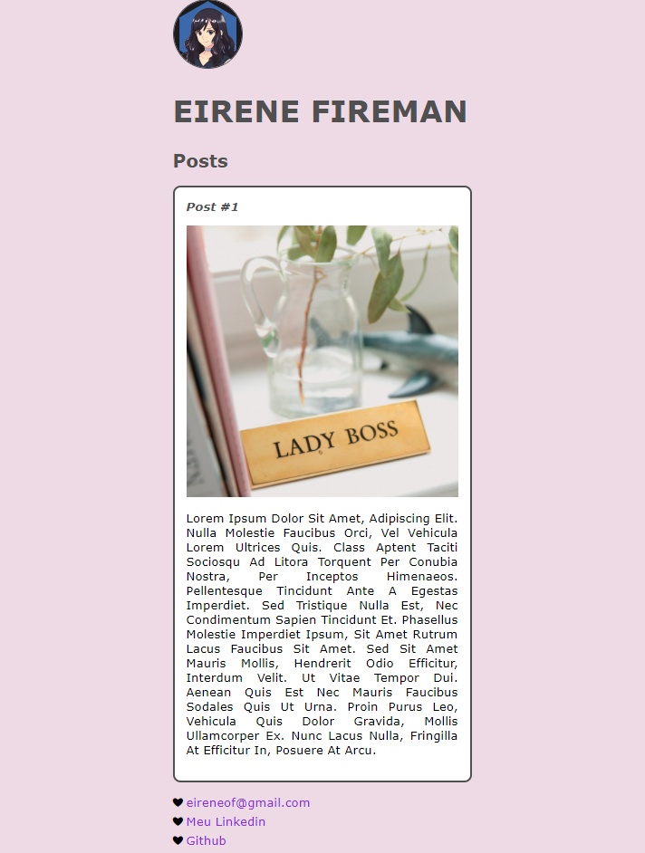

# "Protótipo" de perfil :sparkles:

### Como rodar o projeto?

* Faça o *download* dele no seu computador.
* Acesse o local de `index.html` pelo seu navegador.

### O que foi implementado:

* Noções estruturar um documento HTML com as tags: `<head>`, `<body>`, `<header>`, `<section>`, `<article`, `<footer>`.
    * *OBS: a tag `<aside>`não foi implementada, porém foi estudada.*
* Como criar e estruturar um conjunto de regras no CSS. Utilizando um *selector* e fazendo uma *declaration* dentro dele com uma *propety* e um *propety value*.
* Foram utilizados *selectors* para elementos, ID e classe. 
* As propriedades base utilizadas e estudadas foram: `margin`, `padding`, `border` e outras básicas para a modificação do `content`, visando entender melhor o funcionamento do *box model*

### Curiosidades:

* A imagem do avatar, que é originalmente retangular, foi modificada utilizando a declaração: `border-radius: 50%;`.
* O link de email encaminha o usuário diretamente para o serviço de email padrão do cliente, se este tiver um. `href="mailTo:eireneof@gmail.com"`
* Os links de "Meu Linkedin" e "Github" são abertos em uma nova guia com `target="_blank"`.

**
Qualquer sugestão é só enviar! &#11088;
** 

